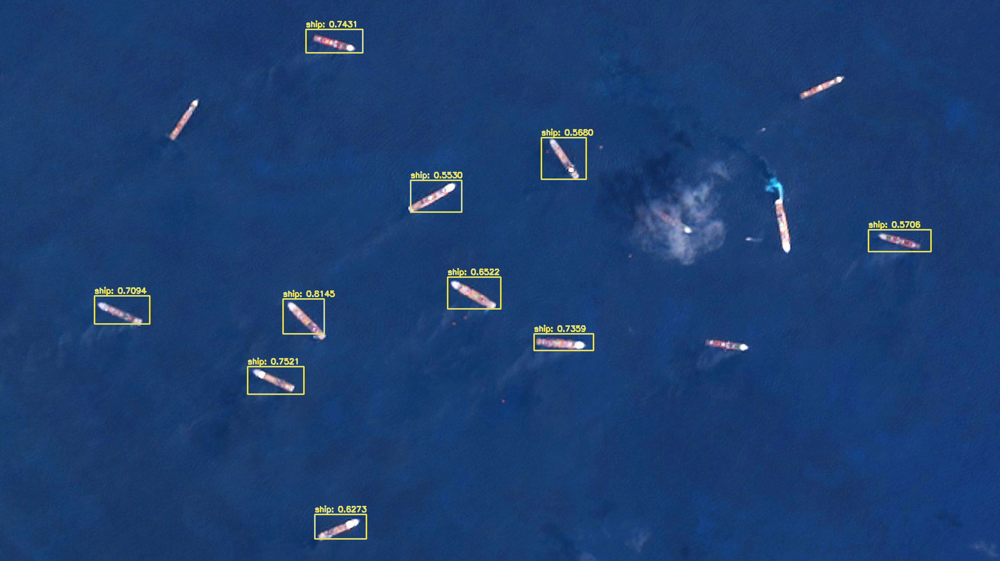

## Shipper

#### ML

Object Detection API for identifying Ships from Satellite Imagery.

Traffic Management System for Coastal Regions.
Developed for **ASEAN-India Hackathon** 2021 - PS7 and won **Encouragement Award**.

Uses OpenCV, Darknet and YOLO v3 for detection and segmentation. Pillow for Image handling, and Flask for API Requests. 


## Getting Started

Open the application in your web browser on [http://localhost:3000](http://localhost:3000)

Upload an Image and the model will identify ships from the image, then the result will be displayed.
You can use the sample image [Shipper_ML_Sample.jpg](Shipper_ML_Sample.jpg). The output will be displayed like below.



---
## Local Development

### Prerequisites

- Python 3.6+
- OpenCV

### Install Dependencies

```bash
pip install -r requirements.txt
```

### Download the Pre-trained Model

```bash
wget "https://www.dropbox.com/s/ngy6qx4hxfj6wru/yolov3-ship_1200.weights?dl=1" model/yolov3-ship_1200.weights
```

If on Windows, Copy the link and paste in browser. Download the Model and paste it in the [`model`](model) directory. 
### Start Development Server

```bash
flask run
or 
python app.py
```

This will start a develoment server  on [http://localhost:5000](http://localhost:5000)

---

## LICENSE
[Eclipse Public License (EPL)](https://www.eclipse.org/legal/epl-2.0/)

You are free to modify the code. Redistributions are not allowed without prior request from the original author. You are obligated to include the full **license** and the **copyrights**.